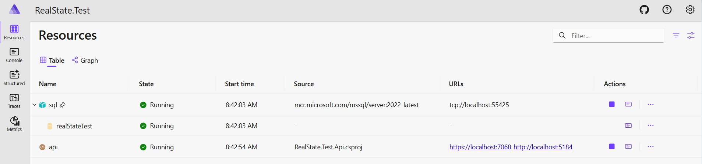

# real-state-test

## Overview

This project is a sample Real State API designed for interview and demonstration purposes.  
It follows a clean architecture approach with separate layers for Domain, Application, Infrastructure, and API.  
The solution supports property management operations such as creating properties, updating property info, changing prices, adding images, and listing properties.

## Running the Project

You can run the entire solution using the **AspireHost** project, which orchestrates the API and SQL Server database using [Microsoft Aspire](https://learn.microsoft.com/en-us/dotnet/aspire/overview/).  
Once started, you can view and manage all resources via the Aspire dashboard.



## Testing the API

For manual API testing, several `.http` files are provided in the [`RealState.Test.Api/Development`](RealState.Test.Api/Development) folder:

- `CreateProperty.http`
- `ChangePropertyPrice.http`
- `UpdatePropertyInfo.http`
- `ListProperties.http`

These files contain ready-to-use HTTP requests for testing the main endpoints.

## Structure

- **Domain**: Core business logic and entities.
- **Application**: Use cases, handlers, and validation.
- **Infrastructure**: External integrations (e.g., image storage).
- **API**: ASP.NET Core endpoints.

## How to Start

1. Restore NuGet packages:
   ```sh
   dotnet restore
   ```
2. Run the AspireHost project:
   ```sh
   dotnet run --project RealState.Test.AppHost
   ```
3. Access the API via the URLs shown in the Aspire dashboard.

## Notes

- The solution uses .NET 9 and modern best practices.
- All main features are covered by unit tests.
- For more details, explore the source code and test files.

## ToDos

- Complete infrastructure tests for repository layer
- Add BlobStorage using local emulator to save images
